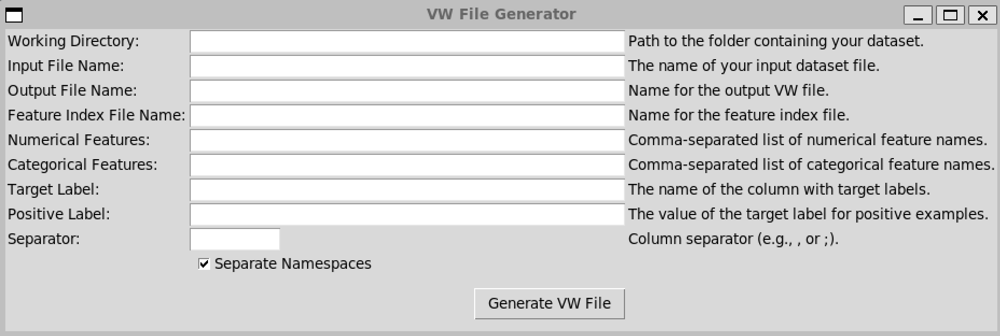

### Description:
This simple program enables the conversion of tabular dataset to vowpal wabbit file.

`Caution`: this implementation assumes the 
* **outcome** is binary (`true/false`, `yes/no`, etc.)
* **namespaces** consist only `numerical` and `categorical` features


### Instructions for use

1. **Clone the repository**:
```bash
git clone https://github.com/MustaphaU/vw_gui.git
```

2. **Navigate to the project directory**
```bash
cd vw_gui
```

3. **Place the csv file containing the data in the [data_gui](./data) folder**

4. **Install the requirements**
```bash
pip install -r requirements.txt
```
5. **Start the app using the command**
```bash
python vw_gui.py
```
Once the app starts, you should see the interface:


6. **Fill out the fields correctly and hit the generate button. This will generate the vowpal wabbit and save it in the [data_gui](./data_gui) folder.**


